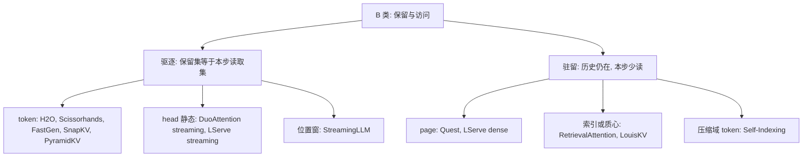

# B 类精读：历史 KV 保留多少，本步读取多少

整理日期：2026-09-22。对象是文献清单 **B01–B12**。书目与归类以 [文献清单](../literature-survey-reading-list.md) 为准，本文不另建清单。课题对照口径见 [项目范围](../project-scope.md)。

第 1–5 节回答本类的五个问题。第 6 节是逐篇要点。第 7 节记录不改变上述回答的其他观点。第 8 节分成两段：可以写入课题模型的判断，以及这些论文尚未覆盖、不能写成已经证实的部分。

数字取自各篇开放全文的方法、实验与附录。原文没有的测量写「未报告」。效率倍数只作该论文自己的基线对照，不换算成课题口径，也不直接写成 Attention 引擎的加速。

问题来自项目范围第 2.6–2.7 节：把仍驻留的历史 KV 和本 decode 步实际参与 Attention 的 KV 分开，并追问选择粒度、元数据扫描、地址与 head 重叠，以及选择、追加写入、元数据更新如何随上下文变长。

## 阅读边界

阅读范围、版本和不能外推的部分记在这里。第 1–5 节的数字都受这些限制。

- 各篇使用开放全文的方法与实验设定（arXiv HTML）。LouisKV 的 GQA 策略另核对其 PDF 附录。
- 第 4 节的页地址集中度，以及不同 query head 读取集合的重叠，原文没有给出测量值，正文写「未报告」。
- Quest 正文第 3.5 节印出的例子与访存公式不一致。核算写在第 6 节 B05；「top 4K pages ⇒ $8\times$」不能当成已闭合的访存量。

---

## 1. 历史 KV 保留多少，本步读取多少？

B 类分成两种驻留方式。

**驱逐型：填满预算后，保留集就是本步读取集。** 被丢掉的 KV 之后不能再读，容量和本步带宽一起下降。

| 编号 | 保留 / 本步读取 | 主实验里的预算 |
|---|---|---|
| B01 H2O | 累积分最高的 heavy hitter，加上最近 token；预算对半 | 常见设定为全量 KV 的 20% |
| B02 Scissorhands | 每个 head 固定 $B$ 个 token：近期 $r$ 个必留，其余按历史窗内的低分计数丢掉 | 全部实验 $r=10$，历史窗 $w=400$，一次压缩丢掉 $m=0.5B$ |
| B03 StreamingLLM | 起始 sink + 滚动近期窗 | 4 个起始 token 即够恢复；语言建模里 Llama-2 缓存 2048，Falcon / Pythia / MPT 为 1024 |
| B04 FastGen | 每个 head 一套固定策略：特殊 token、标点、局部、高频或全保留 | $r_l=r_f=0.3$；65B 上以约 95% 的 attention map 恢复换约 40% 压缩 |
| B06 SnapKV | prefill 末把 prompt 压成「选中前缀 ∪ 整个观察窗」；之后不再重选这段 prompt | 观察窗与容量随实验变化：Needle 为容量 1024、窗 16、pooling 核 5；LongBench 为 1024/2048/4096、窗 32、核 7 |
| B07 DuoAttention | retrieval head 保留并每步读取全部历史；streaming head 只留 sink + recent | MHA（Llama-2-7B）25% retrieval head；GQA（Llama-3-8B）50%。长上下文部署为 64 sink + 256 recent |
| B09 PyramidKV | 每层保留 $k^l$ 个 token，其余在整个生成过程中不再使用 | 下层多、上层少；$\beta=20$，每层必留最后 $\alpha=8$ 个 token。平均保留约 12% 时接近全缓存，极端约 0.7% |

**驻留型：历史仍在，本步只读预算内的子集。** 容量不因「本步没读」而下降。

| 编号 | 仍保留 | 本步读取 |
|---|---|---|
| B05 Quest | 全部 KV。前两层不做选择，始终全读 | Top-$K$ 页。精度实验的 token budget 为 256–4K；32K 上下文、budget 2048 时 self-attention 相对 FlashInfer 为 $7.03\times$ |
| B08 LServe | streaming head 按 $\Lambda$ 模式只组织 sink + 局部块；dense head 的历史页继续分页保存 | dense head 只加载选中的物理页。默认一半 head 为 streaming，动态 token budget 4096（RULER 另有 8192） |
| B10 RetrievalAttention | 全部 KV：GPU 上固定 640（128 sink + 512 局部窗），其余在 CPU 并建索引 | 640 + 检索到的 token。默认为 top-100；KV Retrieval 任务另报 top-2000 |
| B11 Self-Indexing | 全部历史以压缩形式留在 GPU：Key/Value 为 2 bit，另有 1 bit sign 索引；64 个 sink 为全精度 | LongBench 总预算 160，其中 64 个 sink 固定参加、动态再选 96。RULER 按比例保留 7.5% 的 token 做 Attention。decode 新 token 默认始终参加 |
| B12 LouisKV | 完整 KV 在 CPU cache pool。前两层完整留在 GPU。GPU 热集为预算 $B$ 的单元，加 sink $S$ 与 local buffer $W$ | 触发检索时加载得分最高的 cluster / segment，约束 $|\mathcal{I}_t|\le B$，再与 local 一起做 Attention。段内复用已加载集合 |

LouisKV 的三组默认是：长输入短输出 $S=32$、$W=512$、$\tau=0.85$，表中预算 512；短输入长输出 $S=500$、$W=128$、$\tau=0.7$，表中预算 1024；长输入长输出 $S=64$、$W=256$、$\tau=0.7$。输入 cluster 的平均大小设为 16。

SnapKV 与 PyramidKV 压的是 prompt。生成 token 的 KV 仍会进入后续 Attention，所以驻留会随生成变长，只是不再随原始 prompt 变长。PyramidKV 写明被丢弃的 KV 在整个生成中不再使用；新生成 token 是否一律追加进各层预算，原文没有单独写清。

---

## 2. 选择发生在哪一级？

| 粒度 | 论文 | 时机 |
|---|---|---|
| token，按 head | H2O、Scissorhands、FastGen、SnapKV、PyramidKV、Self-Indexing | H2O 每步在已保留集合里驱逐；Scissorhands 每累计约 $0.5B$ 个 token 压缩一次；FastGen、SnapKV、PyramidKV 在 prompt 阶段定一次；Self-Indexing 每步按当前 query 做 top-$k$ |
| token，规则位置，各 head 同一规则 | StreamingLLM | 固定 sink + 滚动窗，没有分数排序 |
| KV head / group，静态二分类 | DuoAttention；LServe 的静态一半 | 离线一次。GQA 下 DuoAttention 的门控打在 KV head 上，压缩的是整组 query head |
| page | Quest；LServe 的动态一半 | 每个 query（LServe 可跨步复用）按页 top-$K$ |
| layer 预算不同，层内仍是 token × head | PyramidKV；Scissorhands 只在层间调 $B$ | 一次分配。方向相反：PyramidKV 下层多、上层少；Scissorhands 因后层 persistence 下降而给后层更多预算 |
| token，但是 CPU 上的向量近邻 | RetrievalAttention | 每个 query head 一个索引，每步检索 |
| 可变长 cluster / segment | LouisKV | 输入用 k-means cluster，输出用时间段；只在语义边界触发 |

Quest 的算法按「当前 query 向量」对每页打分，评测模型是 LongChat 与 Yarn-Llama-2 这类 MHA。它没有写 GQA 下多个 query head 如何合成同一个 KV head 的读取集合。FastGen 明确把 GQA 留作后续工作。SnapKV、PyramidKV、Self-Indexing 评了 GQA 模型，但没有写选中集合是按 KV head 共享还是按 query head 各选一次。

---

---

## 3. 为了少读 KV，先扫多少元数据、算多少分数？

少读 KV 之前的代价分成四档。

1. **几乎不扫描。** StreamingLLM 只有窗口指针；RoPE 时对滚动缓存里的 Key 重做位置变换。DuoAttention 的 head 分类在部署前完成，decode 不再打分。
2. **只在已保留的预算内打分，填满后不随全文长度 $S$ 增长。** H2O 用缓存内 token 的历史 attention 累积分，每步在约一个预算大小的集合里驱逐一个 heavy hitter。Scissorhands 在长度为 $w=400$ 的历史窗上累计「低于 $1/t$」的次数，并且不是每步都压缩。FastGen 的策略在 prefill 用完整 attention map 定一次；frequent 策略之后维护保留 token 的累积分。SnapKV、PyramidKV 在 prefill 用观察窗 / 指令 token 对前缀打一次分，候选数随 prompt 长度，decode 不再重算。
3. **每步扫描随 $S$ 线性增长的轻量元数据，再只读预算内的 KV。**
   - Quest：每页两条与 Key 同维的 channel-wise min / max。页数 $L/S$，每页一个上界分。元数据约 $2M\cdot L/S$ 字节，选中页约 $2M\cdot K\cdot S$ 字节，相对全量 KV 为 $1/S + K\cdot S/L$。Top-$K$ 在 $L<128\mathrm{k}$ 时约 5–10 μs，分析里未计入。
   - LServe：逻辑页用同样的 $k_{\max},k_{\min}$；物理页分数是其中逻辑页分数的 max。无复用时每步扫全部逻辑页。默认复用间隔 $C=4$，选择次数约降为 $1/C$。128K、4K budget 时，朴素 selector 0.24 ms，稀疏 Attention 0.12 ms。
   - Self-Indexing：每步对全部 $L$ 个 Key 做压缩域 LUT-GEMV，每个 Key 一个近似分。16K、batch 10 时检索 0.039 ms，全精度 $Kq^{\top}$ 为 0.166 ms。随后只对 top-$k$ 反量化并做稀疏 Attention。
4. **用索引或质心避免每步扫全部 token，但元数据与 KV 本体是两次访问。**
   - RetrievalAttention：prefill 建 attention-aware 图索引。decode 声称扫 1–3% 的 Key 即可让 recall 高于 0.95；对照里 Flat 扫 100%，IVF 约 30–50%。选出的 token 再做精确 Attention。
   - LouisKV：GPU 上保存每个 cluster / segment 的质心。只在 query 相似度跌破 $\tau$ 时对全部质心打分，个数约为 $n/c+m/s$，远小于 token 数。未触发的步复用已加载集合。

Quest 第 3.5 节印出的例子与公式不一致，记录在第 6 节 B05，不能把「top 4K pages ⇒ $8\times$」直接当成已闭合的访存量。

---

## 4. 页地址是否集中？不同 query head 的读取集合重叠多少？

**没有一篇给出「选中页物理地址的集中度」或「不同 query head 读取集合的 Jaccard / 并集放大」的测量值。** 和这个问题最接近的原文本质如下。

- LServe 第 3.5.3 节论证：自然语言的连续性使高分逻辑页倾向于落在相近的物理页里，因此加大物理页不必同比加大 token budget。Figure 13 用精度保持来支持这一点。这是局部性论证，不是地址分布或突发利用率统计。
- LouisKV 观察到输入侧关键 KV 稀疏分散、输出侧密集，并给出相邻 decode 步关键集合的 Jaccard 相似度在段内持续高于 0.8。这是注意力空间分布和时间重叠，不是物理地址集中度。
- DuoAttention 在 head 维重排 Q/K/V，使 retrieval 与 streaming 各自连续，从而用切片代替 scatter/gather。重排的是 head，不是被选 token 的序列地址。
- Scissorhands 的 persistence ratio 一般超过 95%，衡量的是前半句与后半句 pivotal token 的时间重叠。

GQA 下，读取集合会不会因 query head 不同而变成并集，只有两篇写了机制：

- **LouisKV 在组内强制重叠为 100%。** 一组 $g$ 个 query head 共享同一个 KV head。组分数是组内各 query 对同一组质心的 softmax 分数的平均，然后只选出一套 cluster/segment，合并成一次传输。$g=1$ 时退回逐 head。跨 KV group 的重叠未报告。
- **RetrievalAttention 按 query head 各建一个索引。** 理由是同一 GQA 组里不同 query head 的向量分布不同。同一组的索引用指针共享一份 KV 本体。各 query head 实际检索到的 token 集合有多少重叠，未报告。

Quest、LServe 都没有写：多个 query head 的页集合是取并集、取交集，还是只在 KV head 上打一次分。LServe 的式 (1) 只写了 GQA 的张量共享 $\hat h=\lfloor h/n\rfloor$，以及各 head 可以带不同稀疏模式并行。

---

## 5. 选择、追加写入、元数据更新如何随上下文增长？

把「本步 Attention 读多少」和「为了决定读哪些而做的附加工作」分开后，增长关系是：

| 工作 | 随 $S$ 的行为 |
|---|---|
| 驱逐型的 Attention | 预算填满后由预算决定，不再随已生成总长增长。StreamingLLM、DuoAttention 的 streaming head、SnapKV 的压缩 prompt 都属于这一类 |
| Quest / LServe 的页打分 | 随页数线性增长。Quest 的相对开销趋近 $1/\mathrm{PageSize}$；给定 budget 后，近似 Attention 本身接近常数。LServe 在超过约 64K 后，朴素 selector 成为瓶颈；复用间隔 $C$ 把选择次数降到约每 $C$ 步一次 |
| Self-Indexing 的检索 | 每步 LUT-GEMV 扫全长，随 $S$ 线性，但是压缩域上的查表加法。Attention 只处理 top-$k$ |
| RetrievalAttention 的检索 | 目标是亚线性扫描。RTX 4090、Llama-3-8B 上，4K→128K 的每 token 延迟为 0.137 s→0.188 s。A100 上 100K→1M 为 0.159 s→0.172 s，长度增加 10 倍时延迟增加 8% |
| LouisKV 的检索 | 长输出时大多数步只更新 local buffer；语义边界才扫质心并做 CPU→GPU 传输。$\tau$ 越高，触发越频 |
| 追加写入 | 驱逐型每步写入新 token，并在预算内丢掉旧 token。H2O 预分配内存，用新 KV 直接填被驱逐的槽，recent 区用环形队列。Quest 写入全历史，并只增量更新所在页的 min/max。LServe 用两套量化写回（streaming / dense），dense 页追加 min/max。LouisKV 先写入 GPU local buffer，缓冲满再把最老的 segment 卸到 CPU |
| 元数据存储 | Quest / LServe 的 min/max 随页数也就是随 $S$ 增长，但比 KV 本体小一个 page size 因子。Self-Indexing 的 sign 与 2 bit 码随 $L$ 线性，码本和归一化参数是固定开销。LouisKV 的质心数随 cluster / segment 数增长。驱逐型没有随全文 $S$ 增长的页统计表 |

长输入和长输出被分开讨论的主要是 LServe（256k 输入 / 20k 输出时 decode 远长于 prefill）和 LouisKV（三种输入输出组合）。Quest、Self-Indexing、RetrievalAttention 的效率曲线主要对序列长度或长 prompt decode，没有单独的超长输出分解。

---

## 6. 逐篇要点

每篇只保留与第 1–5 节直接相关的机制、实验范围和失效条件。下表先按同一组列对照，分篇依据写在表后。

| 编号 | 保留集 | 本步读取集 | 粒度 | 少读之前的扫描 | 地址 / head 重叠 | 附加开销随 $S$ |
|---|---|---|---|---|---|---|
| B01 | heavy hitter + recent，合计约 20% | 等于保留集 | token × head，每步驱逐 | 预算内累积分 | 未报告 | 填满后随预算 |
| B02 | 每 head $B$ 个 token | 等于保留集 | token × head；后层预算更大 | 每 $0.5B$ 步扫 $w=400$ | persistence 是时间重叠，不是 head 重叠 | 压缩频率由 $m,B$ 决定 |
| B03 | 4 sink + 滚动窗 | 等于保留集 | 位置规则，各 head 相同 | 无打分 | 未报告 | 随缓存大小，不随总长 |
| B04 | 按 head 策略驱逐或全留 | 等于保留集 | head 策略 + token | prefill 一次 | 未报告；GQA 留作未来工作 | 策略选择与生成长度解耦 |
| B05 | 全部历史 | Top-$K$ 页；前两层全读 | page，每步随 query | 每页 min/max，随 $S/S_{\mathrm{page}}$ | 未报告 | 打分线性；Attention 随 budget |
| B06 | 压缩后的 prompt + 增长的生成 KV | 该并集 | token × head，prefill 一次 | 观察窗 × 前缀，一次 | 未报告 | 选择成本在 prefill |
| B07 | retrieval 全留；streaming 为 sink+recent | 与各自保留集相同 | KV head，离线 | 部署期无 | head 维重排；读取重叠未测 | streaming $O(1)$，retrieval $O(S)$ |
| B08 | streaming 为 $\Lambda$；dense 历史仍分页保留 | dense 只读选中物理页 | head 静态 + page 动态 | 逻辑页 min/max；默认可每 4 步一次 | 论证物理页内聚集；head 并集未测 | 朴素选择线性；复用后约除以 $C$ |
| B09 | 层间金字塔预算 | 等于保留集 | layer 预算 × head × token，一次 | 指令 token 的 attention，一次 | 未报告 | 选择在 prefill；分配可预先算完 |
| B10 | CPU 全量 + GPU 640 | 640 + top-100（默认） | token，每 query head 一个索引 | 约 1–3% Key | 索引按 query head 分开，KV 用指针共享；检索集合重叠未测 | 实测延迟随 $S$ 慢增 |
| B11 | GPU 上 2 bit KV + 1 bit sign，全长 | 160 或 7.5%，外加 decode 新 token | token，每步 | 全长 LUT 分 | 未报告 | 检索线性于 $S$，Attention 随 top-$k$ |
| B12 | CPU 全量 + GPU 上 $B{+}S{+}W$ | $\le B$ 的单元 + local | 输入 cluster，输出 segment；GQA 组内一套 | 仅边界：全部质心 | 组内强制同一集合；跨组未测 | 长输出把检索摊到段上 |

---

### B01 H2O

预测第 $i$ 个 token 时只用保留集 $S_i$ 上的 KV；被驱逐条目在归一化时按 0 处理，并且后续步骤不可再访问。主实验反复使用 20% 预算，并且把预算均分给 heavy hitter 和最近 KV。实现上前一段是 heavy hitter、后一段是 recent，recent 用环形队列；驱逐时不交换整块，用新 KV 填入空槽。每个 head 每步驱逐一个 heavy hitter。分数是此前 token 的 attention 累加，不使用未来 token。GQA 下如何共享，未报告。选择器时间没有单独拆出；报告的是含缓存构建的端到端吞吐。

### B02 Scissorhands

每个 attention head 的驻留上限是 $B$。超预算时在历史窗 $[t-w,t]$ 上统计低分次数，recent 的 $r$ 个位置强制保留，再丢掉 $m$ 个。默认 $r=10$、$w=400$、$m=0.5B$。层内 head 均分预算；层间按 persistence 分配，后层 persistence 下降，因此后层预算更大。persistence ratio 是前半句与后半句 pivotal 集合的交集比，多数层超过 95%。这不是 query head 读取集合的重叠率。可以与 4 bit 量化并用。专用 kernel 与跨 head 并集，未报告。

### B03 StreamingLLM

保留集就是 sink 加滚动窗，窗口外的 KV 被驱逐，不能再检索。默认 4 个起始 token。Table 1 中 $4{+}1020$ 能恢复只保留最近 1024 时崩溃的困惑度；1–2 个 sink 不够。Llama-2 的语言建模缓存为 2048，其余三族为 1024，约为预训练窗的一半。没有重要性排序。RoPE 模型缓存旋转前的 Key，每步对滚动缓存重赋相对位置。论文说明这不扩大模型可利用的长期记忆：需要窗口外信息的问答会失败。相对「滑窗并重算」最高约 $22.2\times$，延迟随缓存大小近似线性。

### B04 FastGen

prefill 用完整 attention map 为每个 head 选一个策略，使恢复比例至少为 $T$ 且缓存最小。策略从特殊 token 逐级加到标点、高频、局部，直至全保留。生成阶段沿用该策略，新 token 不是无条件永久保留。实验取 $r_l=r_f=0.3$。65B 上约恢复 95% 的 attention map，压缩约 40%。作者不用 Llama-2-Chat 的 GQA，并把 GQA 留作未来工作。跨 head 读取重叠未报告。

### B05 Quest

全部 KV 保留。每页保存 Key 的逐维 min $m_i$ 与 max $M_i$。当前 query 的页分数是 $\sum_i \max(q_i m_i, q_i M_i)$，再取 top-$K$ 页做精确 Attention。token budget 指选中页内的 token 数。前两层稀疏度低于 10%，实验中这两层保持全量。新 token 插入时只更新所在页的 min/max。

访存比例是

$$
\frac{1}{S}+\frac{K_{\mathrm{pages}}}{N_{\mathrm{pages}}}
=\frac{1}{S}+\frac{K_{\mathrm{pages}}\,S}{L}.
$$

第 3.5 节写：page size 为 16、上下文 64K、选择 top 4K pages 时，访存降为 $1/8$。若 4K 表示 4096 页，则选中 token 数已经等于 64K，上式约为 $1/16+1$，得不出 $8\times$。若 4K 表示 4096 个 token，即 256 页，则上式恰为 $1/8$。效率实验另有独立数字：page size 16、序列 32K、token budget 2048，self-attention $7.03\times$，4 bit 权重下端到端 $2.23\times$。页地址集中度和跨 head 重叠未报告。

### B06 SnapKV

观察窗是 prompt 末尾一段。对每个 head，把观察窗 query 对前缀 key 的 attention 沿 query 求和，做一维 pooling，再取 top-$k$ 并 `gather`。观察窗本身全部保留。prompt 短于容量则不压缩。速度实验写明推理过程中不再额外更新这段 prompt 缓存；输入变长时 decode 延迟因此接近常数（16K、batch 2 时约 $3.6\times$）。生成 KV 仍追加。下标一般不连续。head 间重叠未报告。

### B07 DuoAttention

每个 KV head 有一个门控 $\alpha_{i,j}$。GQA 中一个 KV head 对应整组 query head，压缩按组生效。部署时 $\alpha>\tau$ 的 head 全量缓存并每步全读，其余只用 sink + recent。长上下文评测：Llama-2-7B-32K 为 25% retrieval head，Llama-3-8B 为 50%；64 个 sink、256 个 recent。识别阶段用 128 sink + 256 recent。消融里部署侧约 16 sink + 64 recent 后收益变平。部署前把 Q/K/V 的输出通道按两类 head 重排成连续簇。与 QServe 的 W8 权重、KV4 组合后，Llama-3-8B 在单张 A100-80G 上容纳 3.30M token。没有 per-step 页选择。

### B08 LServe

静态与动态同时存在，并且都落在块稀疏里。一半 head 用 DuoAttention 的门控变成 streaming，$\Lambda$ 模式的示意是 1 个 sink 块加局部块。dense head 在 decode 时做查询相关的页选择，Figure 5 写明只加载被选中的 KV page，因此动态路径减少的是加载量；dense 历史页仍留在分页缓存中。

逻辑页负责打分，物理页负责传输。物理页分数等于所含逻辑页分数的最大值。Figure 7 用 $N_p=8$、$N_l=4$ 示意，$k_{\max}$ 与 $k_{\min}$ 接在物理页末尾，于 prefill 和此前 decode 预计算。低比特 KV 需要更大物理页才能维持带宽：QServe 上 page size 从 128 降到 16，8192 长度、batch 32 时每步延迟从 50.6 ms 升到 77.1 ms。直接把 Quest 式统计用到大页上会损失 Needle 精度。层次化分页用来在较大物理页、相同 token budget 下保住精度。

时间局部性用来复用页表。默认间隔 4；Table 6 在间隔超过 8 之前没有明显精度下降。128K、4K budget 时 selector 已是稀疏 Attention 的两倍。空间局部性是论证加精度实验，没有 head 间并集的测量。系统建立在 QServe 上，支持权重、激活和 KV 量化；正文把量化与块稀疏写成两种正交杠杆：量化缩短每次迭代，稀疏减少迭代次数。页大小把这两件事重新耦在一起。

### B09 PyramidKV

底层预算 $k^{0}=(2k^{\mathrm{total}})/m$，顶层 $k^{m-1}=k^{\mathrm{total}}/(\beta m)$，中间层按等差变化，使下层多、上层少。实验 $\beta=20$、$\alpha=8$。每个 head 用最后 $\alpha$ 个 token 的 attention 和 pooling 做一次 top-$k^l$。未选中的 KV 在后续生成中不再使用。选择是 token 级 `gather`。GQA 下多个 query 是否共享同一次选择，未报告。

### B10 RetrievalAttention

GPU 静态集固定为 128 个初始 token 加 512 的局部窗。其余 KV 在 CPU。每个 query head 单独建索引；同一 GQA 组共享 KV 指针，不共享索引，因为组内 query 分布不同。默认检索 top-100。$Q\!\to\!K$ 扫 1–3% 可达 recall 高于 0.95。128K、RTX 4090、Llama-3-8B：每 token 0.188 s，其中检索 0.064 s、Attention 0.081 s；相对精确 Flat 为 $4.9\times$，相对 IVF 为 $1.98\times$。A100 上 100K 到 1M 为 0.159 s 到 0.172 s（+8%）。8 bit KV 量化在附录中列为计划，不是主结果。head 间检索集合的重叠未报告。

### B11 Self-Indexing KVCache

压缩 Key 同时充当索引。每 4 维一组 sign pattern，码本大小 16；prefill 一次完成，不用迭代 k-means。检索时 query 与 16 个质心形成 LUT，再对全部 Key 查表求和。Attention 使用的是 2 bit、按 token 分组的绝对值，再用 sign 还原 Key。作者强调 token-wise 参数适合随机访问：channel-wise 要读出整条通道才能还原一个 token。

开销分析按全长 $L$、head 维 128 计算：sign 为 $128L$ bit；K/V 的 2 bit 值为 $512L$ bit；每 32 元一组的 scale 与 zero-point 为 $256L$ bit。随 $L$ 增长的主体约 $768L$ bit 再加 sign，相对 FP16 约节省 78%，与 KIVI 2 bit 的约 $5\times$ 内存同量级。因此容量下降来自全历史的低比特表示。

LongBench 的 160 与 RULER 的 7.5% 是 Attention 参与集。效率节另有一句 「retains only 7.5% of the tokens in the cache」。这句和按全长 $L$ 计算的开销分析同时出现；Figure 5 又把约 $5\times$ 的内存下降对齐到 2 bit 全缓存。本文把 7.5% 记为 Attention 读取比例，把 $5\times$ 记为压缩存储，不把二者乘在一起。GQA 下选中集是否共享，未报告。

### B12 LouisKV

完整 KV 留在 CPU。检索单元在输入侧是语义 cluster，在输出侧是由 query 相似度切开的时间段。触发条件是各 head 上相邻 query 余弦相似度的平均

$$
r_t=\frac{1}{H}\sum_h \mathrm{cosine}(q_{t-1}^{h},q_t^{h})
$$

低于 $\tau$。段内不再检索。质心是组内 Key 的平均，选中后加载该单元的全部 KV，没有第二次 token 级 top-$k$。

GQA 的 group-consistent selection 把组内 $g$ 个 query 的 softmax 分数取平均，得到该 KV head 的一套下标，再做一次合并传输。前两层保留完整 KV，沿用 Quest 的观察。相对 Arkvale 的最高端到端加速为 $4.7\times$，出现在长输入长输出。召回率和选中块的物理地址集中度未报告。

---

## 7. 其他观点

这些观察与上面五个问题相关，但不是那五个问题的直接答案。

1. **查询相关的重要性不能由历史分数代替。** Quest 用 Top-10 attention token 的召回说明：按历史驱逐会丢掉对当前 query 才重要的 token；页上界随当前 query 重估。RetrievalAttention 把同一现象量化为恢复率从 89% 降到 71%（动态 top-1000 对静态沿用首 token 的 top-1000）。

2. **统计粒度和传输粒度可以被拆开。** LServe 用逻辑页计算 min/max，用更大的物理页做量化 KV 的传输。直接增大 Quest 的页会让页内 min/max 变钝。Figure 7 的 $8/4$ 只是示意，不是唯一配置。

3. **低比特和稀疏在 GPU 上并不自动正交。** LServe 把「量化缩短单次迭代、稀疏减少迭代次数」写成正交，同时用 Table 1 说明低比特要求更大页，而大页又伤害朴素页统计。Self-Indexing 则批评把索引和量化分成两套结构，并把 1 bit sign 同时用于检索和 Key 重建。

4. **随机访问改变量化分组方向。** Self-Indexing 认为 token-wise 的 scale 才能只读被选中的 token；按通道共享 scale 时，还原一个 token 仍要碰到该通道的参数组织。这和 KIVI 的 Key 按 channel、Value 按 token 是不同约束。

5. **「何时检索」和「检索单位」是两件事情。** LouisKV 用段内 Jaccard $>0.8$ 说明不必每 token 检索；又用输入稀疏、输出密集说明固定 page 会带上大量非关键 KV。cluster 与 segment 的长度可变，平均输入 cluster 仍对齐到 16，以便和 page size 16 的基线比较。

6. **GQA 的组有两种相反处理。** LouisKV 为了避免按 query head 各传一套 KV，在组内合成一个读取集。RetrievalAttention 为了匹配不同 query 分布，按 query head 复制索引，只用指针避免复制 KV 本体。DuoAttention 更早：门控和缓存都按 KV head 组，组内不能一个 query 全留、另一个 query 只留窗口。

7. **head 类型可以用输出偏差来定，而不只看 attention 图。** DuoAttention 在合成 passkey 上优化门控，比较「全量」与「sink+recent」两种输出。FastGen 则在真实 prompt 的 attention map 上为每个 head 选策略，并假设生成过程中结构稳定。

8. **sink 是 softmax 的落点。** StreamingLLM 用换行符替换起始 token 后仍能恢复困惑度，说明被保留的是位置上的全局可见 token。深层 head 普遍关注起始 token；最底两层更局部。可学习的 sink token 能把需要保留的起始 token 减到一个，但那需要重新预训练。

9. **层间预算的方向并不一致。** PyramidKV 根据下层注意力分散、上层集中，给下层更多 token。Scissorhands 根据后层 persistence 下降，给后层更多 token。二者都在层间改变保留数量，都不是跨层合并张量。

10. **一次性 prompt 压缩和每步驱逐解决的长度不同。** SnapKV 针对长 prompt、较短生成，并用 pooling 保住 top-$k$ 周围的局部上下文。H2O 与 Scissorhands 针对生成过程中不断变长的缓存。StreamingLLM 能把语言建模延长到约 4M token，同时明确不增加可检索的历史。

11. **选择结果可以跨 decode 步复用，精度有平台。** LServe 默认每 4 步重选，超过 8 步后 RULER 下降。LouisKV 的复用长度由语义边界决定，不是固定步数。Quest 每步重选。

12. **页选择的 top-$k$ 本身很便宜，扫描元数据并不便宜。** Quest 把 top-$k$ 标成 5–10 μs。LServe 在 128K 上测到 selector 超过稀疏 Attention。Self-Indexing 的 LUT 比全精度内积快，但仍扫过全部 Key。

---

## 8. 对本课题的直接含义

下面只写可以沿用的判断，以及这些论文没有在本课题工作点上测过的外推。

### 可以写入课题模型的

- 这些论文给出的是保留策略和 GPU/CPU 上的读取策略。驱逐型在预算填满后，保留集等于本步读取集；驻留型的历史仍在，本步未读的 KV 仍占容量。

### 不能写成已经证实的

它们没有提供数字 Attention 引擎里的 bank 冲突、突发利用率或 RTL 级选择器。和范围文档第 2.7 节直接相关、而 B 类仍空着的测量是：

- GQA 下一组 query head 的页集合若取并集，去重后的读取字节比单个 query 的预算大多少。LouisKV 用组内平均分避免并集，RetrievalAttention 保留了按 query head 分开的索引；二者都没有报告并集放大系数。
- 选中物理页的地址是否足够集中，使按页传输的突发利用率高于任意 token gather。LServe 只论证了语义上的相邻，没有报地址或利用率。
- 量化后的 min/max 与全精度 min/max 选出的页差多少。Quest 与 LServe 的上界用的是页内 Key 统计；LServe 的图把量化省略掉了。Self-Indexing 把打分和存储合成同一套低比特码，但是 token 级随机访问，不是 page。
- 追加写入、页统计更新和选择在同一条数据通路里的最坏周期。现有拆分是 GPU kernel 时间，且多数驱逐论文只给端到端结果。
